# Context Diagram (Level 0 DFD)

```mermaid
flowchart TB
    subgraph External_Entities
        Donor[👤 DONOR<br/>Individuals/Organizations<br/>providing food]
        Recipient[👥 RECIPIENT<br/>Families requesting<br/>food assistance]
        Volunteer[🤝 VOLUNTEER<br/>Coordinating<br/>deliveries]
        Admin[👨‍💼 ADMIN<br/>System<br/>administrators]
    end
    
    subgraph System
        Platform[🏢 SUSTAIN A SHARE<br/>PLATFORM<br/>Food Donation<br/>Management System]
    end
    
    Database[(🗄️ MongoDB<br/>Atlas)]
    
    %% Donor interactions
    Donor -->|Donor Profile Information| Platform
    Donor -->|Fund Donation Request| Platform
    Platform -->|Approved Donations List| Donor
    Platform -->|Donation Status Updates| Donor
    
    %% Recipient interactions
    Recipient -->|Donation Request| Platform
    Recipient -->|Recipient Profile Info| Platform
    Platform -->|Request Status| Recipient
    Platform -->|Donor Information| Recipient
    
    %% Volunteer interactions
    Volunteer -->|Volunteer Profile| Platform
    Volunteer -->|Delivery Coordination| Platform
    Platform -->|Active Donations List| Volunteer
    Platform -->|Delivery Tasks| Volunteer
    
    %% Admin interactions
    Admin -->|Review & Approval| Platform
    Admin -->|User Management| Platform
    Platform -->|Pending Requests| Admin
    Platform -->|System Reports| Admin
    
    %% Database interactions
    Platform <-->|User Data<br/>Profiles<br/>Donations<br/>Reviews| Database
    
    style Platform fill:#4a90e2,stroke:#2c5aa0,stroke-width:3px,color:#fff
    style Database fill:#27ae60,stroke:#1e8449,stroke-width:2px,color:#fff
    style Donor fill:#e74c3c,stroke:#c0392b,stroke-width:2px,color:#fff
    style Recipient fill:#f39c12,stroke:#d68910,stroke-width:2px,color:#fff
    style Volunteer fill:#9b59b6,stroke:#7d3c98,stroke-width:2px,color:#fff
    style Admin fill:#34495e,stroke:#2c3e50,stroke-width:2px,color:#fff
```

## Legend

- **External Entities** (rectangles): People or systems that interact with the platform
- **System** (rounded rectangle): The Sustain a Share Platform
- **Data Store** (cylinder): MongoDB Atlas Database
- **Data Flows** (arrows): Direction of information flow

## Key Data Flows

| From | To | Data Description |
|------|-----|------------------|
| Donor | Platform | Profile information, funding commitments |
| Recipient | Platform | Donation requests, profile information |
| Volunteer | Platform | Availability, delivery coordination |
| Admin | Platform | Approvals, rejections, user management |
| Platform | Database | All persistent data storage |
