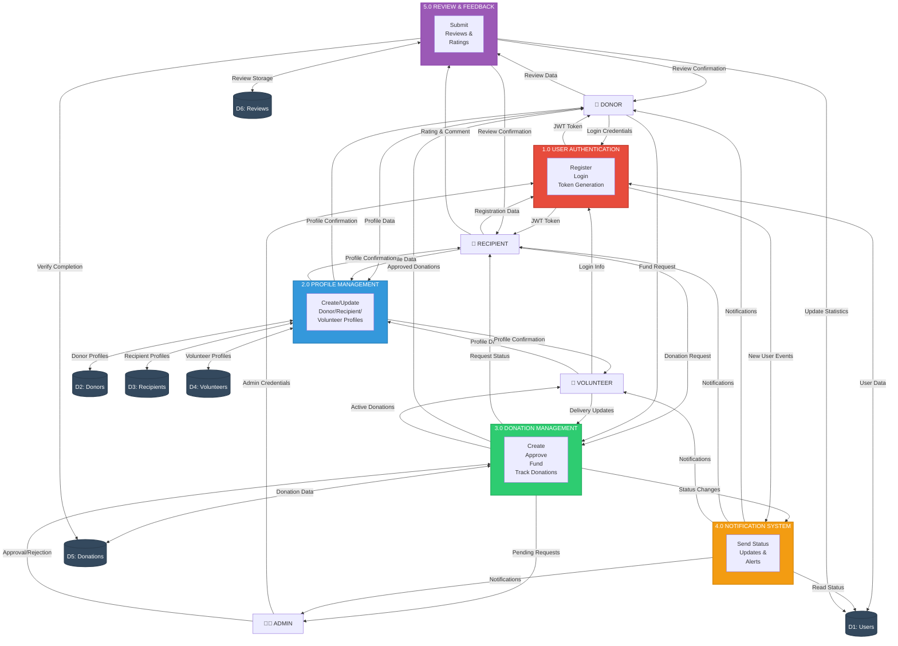

# Level 1 Data Flow Diagram

## Process Descriptions

### 1.0 User Authentication
- **Purpose**: Manage user registration and login
- **Inputs**: Email, password, user details
- **Outputs**: JWT access tokens, user authentication status
- **Data Stores**: D1 (Users)

### 2.0 Profile Management
- **Purpose**: Create and maintain user profiles by role
- **Inputs**: Profile information specific to donor/recipient/volunteer
- **Outputs**: Profile confirmation, profile data
- **Data Stores**: D2 (Donors), D3 (Recipients), D4 (Volunteers)

### 3.0 Donation Management
- **Purpose**: Handle complete donation lifecycle
- **Inputs**: Donation requests, approvals, funding commitments
- **Outputs**: Status updates, donation tracking information
- **Data Stores**: D5 (Donations)

### 4.0 Notification System
- **Purpose**: Send real-time updates to users
- **Inputs**: Status changes, system events
- **Outputs**: Notifications to all user types
- **Data Stores**: D1 (Users - for notification preferences)

### 5.0 Review & Feedback
- **Purpose**: Collect and manage user reviews
- **Inputs**: Ratings, comments, feedback
- **Outputs**: Review confirmations, updated statistics
- **Data Stores**: D5 (Donations), D6 (Reviews)
