# Level 2 DFD - User Authentication (Process 1.0)

## Registration Flow

## Login Flow

## Token Validation Flow (Protected Routes)

```mermaid
flowchart TB
    Client[💻 CLIENT<br/>with JWT Token]
    
    subgraph Validation[" "]
        P16[1.6<br/>EXTRACT TOKEN<br/>from Header]
        P17[1.7<br/>DECODE & VERIFY<br/>JWT Signature]
        P18[1.8<br/>CHECK<br/>EXPIRATION]
        P19[1.9<br/>FETCH USER<br/>from Database]
    end
    
    D1V[(D1: Users)]
    Route[🛣️ PROTECTED<br/>ROUTE]
    
    Client -->|Authorization:<br/>Bearer token| P16
    P16 -->|Extracted Token| P17
    P17 -->|Verify Signature<br/>with SECRET_KEY| P18
    P18 -->|Check exp claim| P19
    P19 -->|Query by user_id| D1V
    D1V -->|User Object| P19
    P19 -->|Authenticated User| Route
    Route -->|Response| Client
    
    style P16 fill:#e74c3c,stroke:#c0392b,stroke-width:2px,color:#fff
    style P17 fill:#e67e22,stroke:#d35400,stroke-width:2px,color:#fff
    style P18 fill:#d35400,stroke:#ba4a00,stroke-width:2px,color:#fff
    style P19 fill:#c0392b,stroke:#a93226,stroke-width:2px,color:#fff
    style D1V fill:#34495e,stroke:#2c3e50,stroke-width:2px,color:#fff
    style Route fill:#27ae60,stroke:#1e8449,stroke-width:2px,color:#fff
```

## Process Details

### 1.1 Validate User Registration
- **Input**: Registration form (email, password, full_name, role)
- **Process**: 
  - Validate email format
  - Check password strength (min 8 characters)
  - Verify role is valid (donor/recipient/volunteer/admin)
  - Check email uniqueness
- **Output**: Validation result (pass/fail)

### 1.2 Hash Password & Create User
- **Input**: Validated user data
- **Process**:
  - Hash password using bcrypt (cost factor: 12)
  - Create user document
  - Insert into MongoDB users collection
- **Output**: User ID, confirmation

### 1.3 Generate JWT Token
- **Input**: User ID, role
- **Process**:
  - Create JWT payload: {sub: user_id, role: role}
  - Sign with SECRET_KEY using HS256 algorithm
  - Set expiration time (300 minutes)
- **Output**: JWT access token

### 1.4 Verify Credentials
- **Input**: Email, password
- **Process**:
  - Query database for user by email
  - Check if user exists
- **Output**: User record with hashed password

### 1.5 Verify Password (Bcrypt)
- **Input**: Plain password, hashed password
- **Process**:
  - Use bcrypt.verify() to compare
  - Return true/false
- **Output**: Password validity

### 1.6 Extract Token from Header
- **Input**: HTTP Authorization header
- **Process**:
  - Extract "Bearer {token}" format
  - Parse token string
- **Output**: JWT token string

### 1.7 Decode & Verify JWT Signature
- **Input**: JWT token
- **Process**:
  - Decode token
  - Verify signature with SECRET_KEY
  - Ensure algorithm is HS256
- **Output**: Decoded payload

### 1.8 Check Expiration
- **Input**: Decoded JWT payload
- **Process**:
  - Extract 'exp' claim
  - Compare with current timestamp
- **Output**: Valid/Expired status

### 1.9 Fetch User from Database
- **Input**: User ID from token payload
- **Process**:
  - Query users collection by _id
  - Return user object
- **Output**: Complete user details
