# Level 2 DFD - Donation Management (Process 3.0)

## Complete Donation Lifecycle

```mermaid
flowchart TB
    Recipient[👥 RECIPIENT]
    Admin[👨‍💼 ADMIN]
    Donor[👤 DONOR]
    Volunteer[🤝 VOLUNTEER]
    
    subgraph Creation["CREATION PHASE"]
        P31[3.1<br/>VALIDATE<br/>DONATION REQUEST]
        P32[3.2<br/>CREATE DONATION<br/>Status: Pending]
    end
    
    subgraph Approval["APPROVAL PHASE"]
        P33[3.3<br/>REVIEW<br/>DONATION REQUEST]
        P34[3.4<br/>APPROVE<br/>DONATION]
        P35[3.5<br/>REJECT<br/>DONATION]
    end
    
    subgraph Funding["FUNDING PHASE"]
        P36[3.6<br/>PROCESS DONOR<br/>FUNDING]
        P37[3.7<br/>UPDATE DONATION<br/>STATUS]
    end
    
    subgraph Completion["COMPLETION PHASE"]
        P38[3.8<br/>TRACK DELIVERY<br/>& COMPLETION]
    end
    
    D5[(D5: Donations)]
    
    %% Creation Flow
    Recipient -->|Donation Request<br/>food_item, quantity<br/>price, description| P31
    P31 -->|Valid Request| P32
    P32 -->|Store with<br/>status: pending| D5
    
    %% Approval Flow
    D5 -->|Pending Donations| P33
    Admin -->|Review Request| P33
    P33 -->|Approve| P34
    P33 -->|Reject| P35
    P34 -->|Update status:<br/>approved| D5
    P35 -->|Update status:<br/>rejected + reason| D5
    
    %% Funding Flow
    D5 -->|Approved Donations| P36
    Donor -->|Fund Request<br/>+ donor_id| P36
    P36 -->|Add donor_id| P37
    P37 -->|Update status:<br/>funded| D5
    
    %% Completion Flow
    D5 -->|Funded Donations| P38
    Volunteer -->|Coordinate<br/>Delivery| P38
    P38 -->|Update status:<br/>completed| D5
    
    %% Feedback to users
    D5 -->|Status Updates| Recipient
    D5 -->|Approved List| Donor
    D5 -->|Active Donations| Volunteer
    D5 -->|Reports| Admin
    
    style Creation fill:#e8f5e9,stroke:#4caf50,stroke-width:2px
    style Approval fill:#fff3e0,stroke:#ff9800,stroke-width:2px
    style Funding fill:#e3f2fd,stroke:#2196f3,stroke-width:2px
    style Completion fill:#f3e5f5,stroke:#9c27b0,stroke-width:2px
    
    style P31 fill:#66bb6a,stroke:#4caf50,stroke-width:2px,color:#fff
    style P32 fill:#66bb6a,stroke:#4caf50,stroke-width:2px,color:#fff
    style P33 fill:#ffa726,stroke:#ff9800,stroke-width:2px,color:#fff
    style P34 fill:#ffa726,stroke:#ff9800,stroke-width:2px,color:#fff
    style P35 fill:#ef5350,stroke:#f44336,stroke-width:2px,color:#fff
    style P36 fill:#42a5f5,stroke:#2196f3,stroke-width:2px,color:#fff
    style P37 fill:#42a5f5,stroke:#2196f3,stroke-width:2px,color:#fff
    style P38 fill:#ab47bc,stroke:#9c27b0,stroke-width:2px,color:#fff
    style D5 fill:#34495e,stroke:#2c3e50,stroke-width:2px,color:#fff
```

## Status State Diagram

## Detailed Process Flow

## Process Details

### 3.1 Validate Donation Request
- **Input**: Food item, quantity, price, description, recipient_id
- **Validations**:
  - All required fields present
  - Quantity > 0
  - Price >= 0
  - Recipient profile exists
  - Valid food item name
- **Output**: Valid/Invalid + error messages

### 3.2 Create Donation (Status: Pending)
- **Input**: Validated donation data
- **Process**:
  - Generate unique donation ID
  - Set status = "pending"
  - Add timestamp (created_at)
  - Link to recipient_id
  - Insert into donations collection
- **Output**: Donation ID, confirmation

### 3.3 Review Donation Request
- **Input**: Pending donation details
- **Admin Review Criteria**:
  - Recipient eligibility verification
  - Request reasonability
  - Urgency assessment
  - Available resources check
- **Output**: Approve/Reject decision

### 3.4 Approve Donation
- **Input**: Donation ID, admin decision
- **Process**:
  - Update status = "approved"
  - Add approved_at timestamp
  - Add approved_by (admin user_id)
  - Update donation record
- **Output**: Approval confirmation

### 3.5 Reject Donation
- **Input**: Donation ID, rejection reason
- **Process**:
  - Update status = "rejected"
  - Add rejection_reason
  - Add rejected_at timestamp
  - Update donation record
- **Output**: Rejection confirmation

### 3.6 Process Donor Funding
- **Input**: Donation ID, donor_id
- **Validations**:
  - Donation status is "approved"
  - Donor profile exists
  - Donor not already assigned
- **Output**: Funding acceptance

### 3.7 Update Donation Status
- **Input**: Donation ID, new status, donor_id
- **Process**:
  - Update status = "funded"
  - Add donor_id
  - Add funded_at timestamp
  - Update donation record
- **Output**: Status update confirmation

### 3.8 Track Delivery & Completion
- **Input**: Donation ID, delivery status
- **Process**:
  - Coordinate pickup with donor
  - Coordinate delivery with recipient
  - Track delivery progress
  - Confirm delivery completion
  - Update status = "completed"
  - Add completed_at timestamp
- **Output**: Completion confirmation

## Data Validation Rules

| Field | Validation | Error Message |
|-------|-----------|---------------|
| food_item | Required, min 2 chars | "Food item name is required" |
| quantity | Required, > 0 | "Quantity must be greater than 0" |
| price | Required, >= 0 | "Price cannot be negative" |
| description | Required, min 10 chars | "Please provide detailed description" |
| recipient_id | Valid ObjectId, exists in DB | "Invalid recipient" |
| status | One of: pending/approved/funded/completed/rejected | "Invalid status" |

## Status Transition Rules

| From Status | To Status | Authorized Role | Conditions |
|-------------|-----------|-----------------|------------|
| - | pending | Recipient | Valid request data |
| pending | approved | Admin | Request meets criteria |
| pending | rejected | Admin | Request doesn't qualify |
| approved | funded | Donor | Donor commits to fulfill |
| funded | completed | Volunteer/Admin | Delivery confirmed |
| Any | Any | Admin | Override capability |
