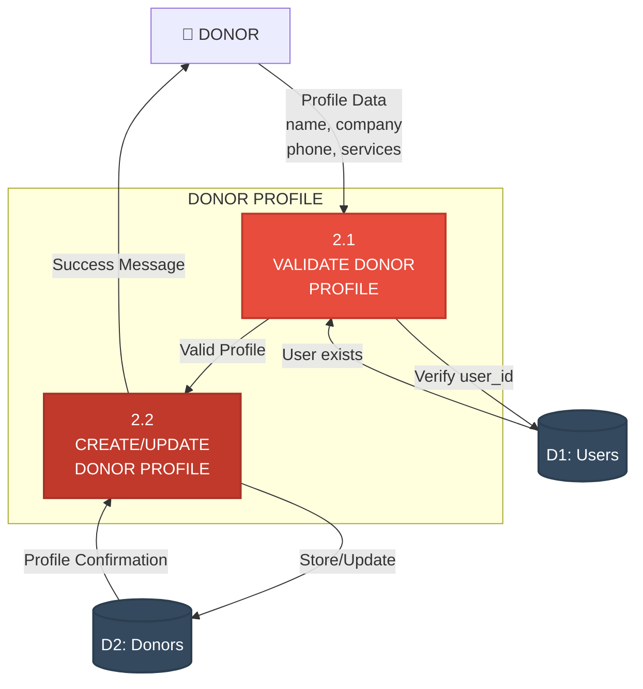
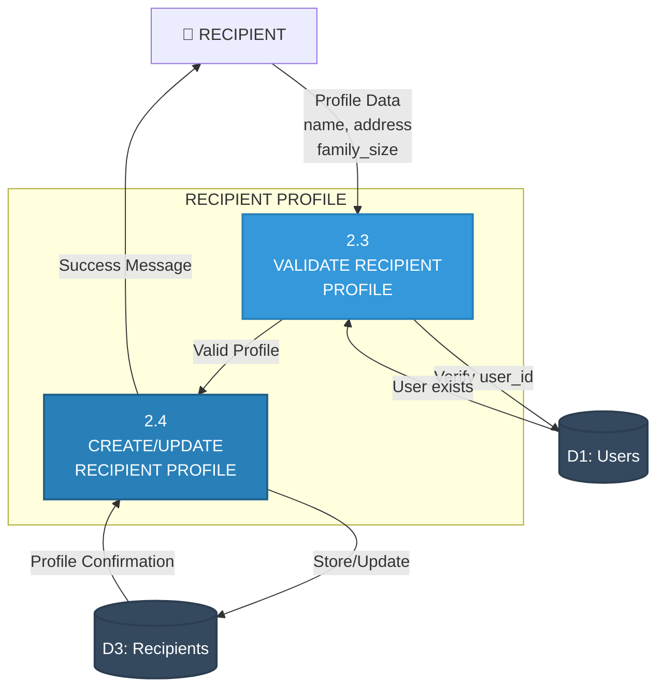
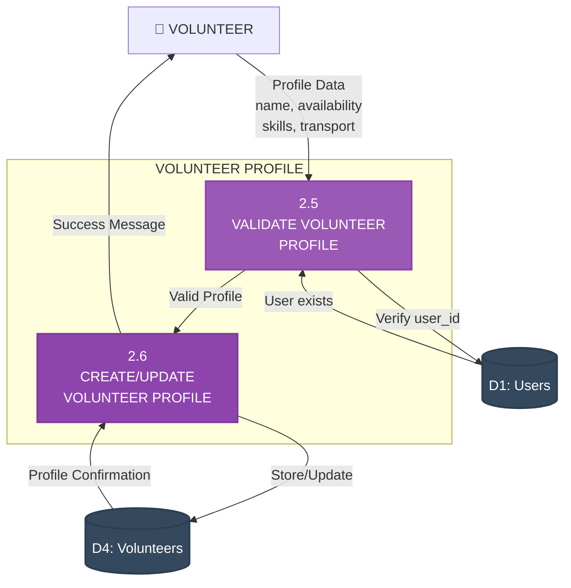
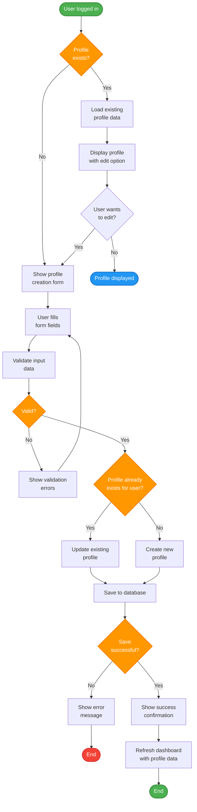
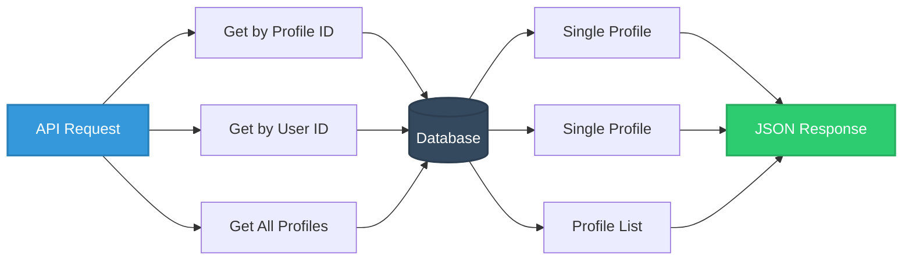

# Level 2 DFD - Profile Management (Process 2.0)

## Donor Profile Management

## Recipient Profile Management

## Volunteer Profile Management

## Unified Profile Management Flow

## Process Details

### 2.1 Validate Donor Profile
- **Input**: 
  - user_id (from JWT token)
  - first_name, last_name, title
  - phone_number
  - company, type_of_company
  - services_interested_in
  - participating_locations
  
- **Validations**:
  - user_id exists in Users collection
  - User role is "donor"
  - Phone number format valid
  - All required fields present
  - Company name min 2 characters
  
- **Output**: Valid/Invalid + error details

### 2.2 Create/Update Donor Profile
- **Input**: Validated donor data
- **Process**:
  - Check if profile exists for user_id
  - If exists: Update with new data + updated_at timestamp
  - If not exists: Create new with created_at timestamp
  - Calculate total_donations (count)
  - Calculate total_amount_donated (sum)
- **Output**: Profile ID, confirmation

### 2.3 Validate Recipient Profile
- **Input**:
  - user_id (from JWT token)
  - first_name, last_name
  - phone_number, address
  - family_size, household_members
  - income_level, special_needs
  
- **Validations**:
  - user_id exists in Users collection
  - User role is "recipient"
  - Phone number format valid
  - Address min 10 characters
  - family_size > 0
  
- **Output**: Valid/Invalid + error details

### 2.4 Create/Update Recipient Profile
- **Input**: Validated recipient data
- **Process**:
  - Check if profile exists for user_id
  - If exists: Update with new data + updated_at
  - If not exists: Create new with created_at
  - Calculate total_requests (count)
  - Calculate requests_fulfilled (count where status=completed)
- **Output**: Profile ID, confirmation

### 2.5 Validate Volunteer Profile
- **Input**:
  - user_id (from JWT token)
  - first_name, last_name
  - phone_number
  - availability, areas_of_interest
  - transportation (boolean)
  - emergency_contact
  
- **Validations**:
  - user_id exists in Users collection
  - User role is "volunteer"
  - Phone number format valid
  - Availability field not empty
  - Emergency contact provided
  
- **Output**: Valid/Invalid + error details

### 2.6 Create/Update Volunteer Profile
- **Input**: Validated volunteer data
- **Process**:
  - Check if profile exists for user_id
  - If exists: Update with new data + updated_at
  - If not exists: Create new with created_at
  - Initialize hours_volunteered = 0
  - Initialize tasks_completed = 0
- **Output**: Profile ID, confirmation

## Field Validation Rules

### Donor Profile
| Field | Type | Required | Validation |
|-------|------|----------|------------|
| first_name | String | Yes | Min 2, Max 50 chars |
| last_name | String | Yes | Min 2, Max 50 chars |
| title | String | No | Mr., Mrs., Ms., Dr., etc. |
| phone_number | String | Yes | Valid phone format |
| company | String | Yes | Min 2 chars |
| type_of_company | String | No | Category |
| services_interested_in | String | Yes | Comma-separated |
| participating_locations | String | Yes | Comma-separated |

### Recipient Profile
| Field | Type | Required | Validation |
|-------|------|----------|------------|
| first_name | String | Yes | Min 2, Max 50 chars |
| last_name | String | Yes | Min 2, Max 50 chars |
| phone_number | String | Yes | Valid phone format |
| address | String | Yes | Min 10 chars |
| family_size | Integer | Yes | > 0 |
| household_members | String | No | Description |
| income_level | String | No | low/medium/high |
| special_needs | String | No | Dietary restrictions |

### Volunteer Profile
| Field | Type | Required | Validation |
|-------|------|----------|------------|
| first_name | String | Yes | Min 2, Max 50 chars |
| last_name | String | Yes | Min 2, Max 50 chars |
| phone_number | String | Yes | Valid phone format |
| availability | String | Yes | Not empty |
| areas_of_interest | String | Yes | Not empty |
| transportation | Boolean | Yes | true/false |
| emergency_contact | String | Yes | Min 10 chars |

## Profile Retrieval Methods

