# Level 2 DFD - Review & Feedback System (Process 5.0)

## Review Submission Flow


## Detailed Review Flow


## Review Types and Permissions

```mermaid
flowchart LR
    subgraph ReviewTypes["Review Types"]
        RT1[Donor → Recipient]
        RT2[Recipient → Donor]
        RT3[Volunteer Review]
        RT4[Platform Review]
    end
    
    subgraph Permissions["Who Can Review"]
        P1[Donors:<br/>Review recipients<br/>they funded]
        P2[Recipients:<br/>Review donors<br/>who funded them]
        P3[Volunteers:<br/>Review donations<br/>they coordinated]
        P4[All Users:<br/>Review platform<br/>experience]
    end
    
    RT1 --> P1
    RT2 --> P2
    RT3 --> P3
    RT4 --> P4
    
    style RT1 fill:#e74c3c,stroke:#c0392b,stroke-width:2px,color:#fff
    style RT2 fill:#3498db,stroke:#2980b9,stroke-width:2px,color:#fff
    style RT3 fill:#9b59b6,stroke:#8e44ad,stroke-width:2px,color:#fff
    style RT4 fill:#2ecc71,stroke:#27ae60,stroke-width:2px,color:#fff
```



## Process Details

### 5.1 Validate Review Eligibility
- **Input**: user_id, donation_id, review_type
- **Checks**:
  - User is authenticated
  - Donation exists
  - User was participant in donation
  - Appropriate review_type for user role
  - User hasn't already reviewed this donation
- **Output**: Eligible/Not Eligible + reason

### 5.2 Verify Donation Completion
- **Input**: donation_id
- **Process**:
  - Query donations collection by ID
  - Check status field
  - Verify status = "completed"
  - Extract donor_id and recipient_id
  - Confirm user_id matches participant
- **Output**: Donation details, participant confirmation

### 5.3 Validate Review Content
- **Input**: rating, comment, review_type
- **Validations**:
  - Rating: Integer between 1-5
  - Comment: 
    - Minimum 10 characters
    - Maximum 500 characters
    - No profanity/spam (basic filter)
  - review_type: Valid type from enum
  - Optional: Sentiment analysis
- **Output**: Valid/Invalid + error messages

### 5.4 Store Review
- **Input**: Validated review data
- **Process**:
  - Generate unique review ID
  - Create review document:
    ```json
    {
      "_id": "ObjectId",
      "user_id": "reviewer_id",
      "donation_id": "donation_id",
      "rating": 5,
      "comment": "Great experience!",
      "review_type": "donor_to_recipient",
      "is_public": true,
      "created_at": "timestamp",
      "helpful_count": 0,
      "flagged": false
    }
    ```
  - Insert into reviews collection
- **Output**: Review ID, timestamp

### 5.5 Calculate Average Rating
- **Input**: user_id (reviewee), review_type
- **Process**:
  - Query all reviews for user_id
  - Filter by review_type
  - Calculate average of rating field
  - Round to 1 decimal place
  - Count total reviews
- **Output**: Average rating, review count

### 5.6 Update User Statistics
- **Input**: user_id, average_rating, review_count
- **Process**:
  - Update user document in users collection
  - Add/update fields:
    - average_rating
    - total_reviews
    - last_reviewed_at
  - Update profile collection (donors/recipients)
  - Add rating badge if applicable
- **Output**: Update confirmation

## Rating Calculation Example

```mermaid
graph TD
    subgraph Reviews["User's Received Reviews"]
        R1[Review 1: ⭐⭐⭐⭐⭐ 5]
        R2[Review 2: ⭐⭐⭐⭐ 4]
        R3[Review 3: ⭐⭐⭐⭐⭐ 5]
        R4[Review 4: ⭐⭐⭐⭐ 4]
    end
    
    Reviews --> Calc[Calculate:<br/>5 + 4 + 5 + 4 = 18<br/>18 ÷ 4 = 4.5]
    Calc --> Result[Average Rating:<br/>⭐⭐⭐⭐½ 4.5/5<br/>Based on 4 reviews]
    
    style Calc fill:#3498db,stroke:#2980b9,stroke-width:2px,color:#fff
    style Result fill:#2ecc71,stroke:#27ae60,stroke-width:2px,color:#fff
```



## Review Display Logic


## Validation Rules

| Field | Validation | Error Message |
|-------|-----------|---------------|
| rating | Required, Integer 1-5 | "Rating must be between 1 and 5 stars" |
| comment | Min 10, Max 500 chars | "Comment must be 10-500 characters" |
| donation_id | Valid ObjectId, exists | "Invalid donation" |
| user_id | Authenticated user | "Please login to review" |
| review_type | Valid enum value | "Invalid review type" |
| Duplicate | One review per donation | "You already reviewed this donation" |
| Status | Donation completed | "Can only review completed donations" |
| Participant | User in donation | "You didn't participate in this donation" |

## Review Statistics Tracking


